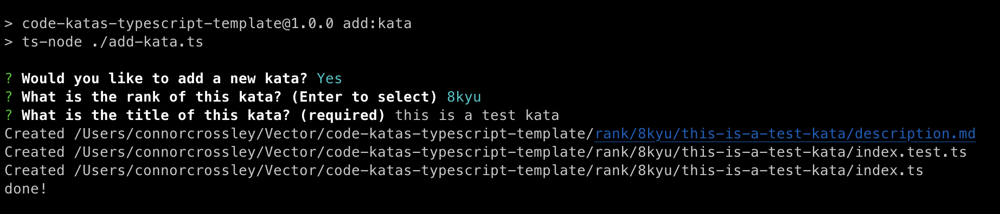

# code-katas-typescript-template

A template repo for organizing, running, and testing code katas in TypeScript

## Getting Started

1. Create a repo using this template, be sure to make the owner your own account and not the vector organization
2. Clone the repo
3. Run `nvm use` to ensure you are using the correct version of node
4. Run `npm install` to install dependencies

## Adding new Katas

The repo is organized to work well with multiple katas of various ranks. Each kata should be categorized in its own rank directory under the `rank` directory. The directory should be named after the kata. For example, if you wanted to add the [Fibonacci kata](https://www.codewars.com/kata/57a1d5ef7cb1f3db590002af), you would create a directory named `fibonacci` under the `rank/7kyu` directory. The directory should contain a file named `index.ts` which exports a function. It should also contain a file name `index.test.ts` that imports the function and tests it. Lastly, include a `description.md` file that contains the kata description.

To simplify the process you can add a new Kata by running `npm run add:kata`.

Selecting the kata rank

And providing a good title

And the rest is done for you!

## Running Tests

This repo uses [Jest](https://jestjs.io/) for testing. To run the tests for all katas, run `npm test`. To run the tests for a specific kata, run `npm test -- <path-to-kata>`. For example, to run the tests for the `fibonacci` kata, run `npm test -- 7kyu/fibonacci`.

We've also installed [jest-runner-groups](https://www.npmjs.com/package/jest-runner-groups) to allow us to run tests for a specific rank. To run the tests for a specific rank, run `npm test -- -g <rank>`. For example, to run the tests for all 7kyu katas, run `npm test -- --group=7kyu`.
